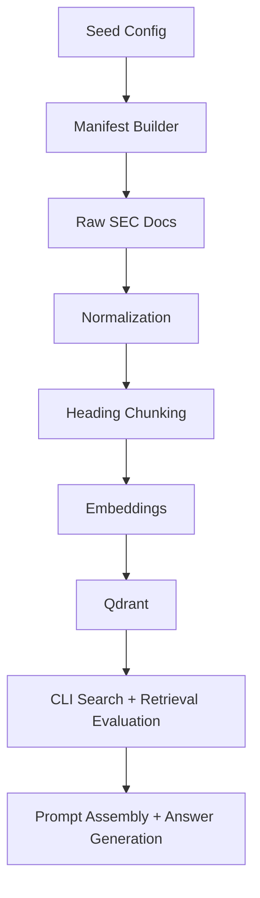

# Market Intelligence RAG

A source-grounded RAG proof of concept over SEC earnings materials for analyzing how major public companies discuss strategy, risk, and investment across quarters.

## Why This Project Exists

Many RAG projects optimize for a generic chat experience over arbitrary text. This project is intentionally narrower.

The goal is to build a small but credible retrieval system over public market data that:

- ingests reproducible SEC materials
- preserves metadata needed for filtering and traceability
- retrieves context for strategic questions
- supports citation-ready outputs instead of vague summaries

The scope is intentionally focused to highlight practical AI data engineering judgment: source selection, metadata design, ingestion quality, and grounded retrieval.

## What The System Does

- builds a small SEC-first proof-of-concept corpus for an initial set of companies
- extracts targeted quarterly earnings material from `8-K` and `10-Q` filings
- pulls selected `8-K` exhibits such as `99.1` when they contain the real earnings narrative
- normalizes filing text and preserves citation metadata
- chunks documents into retrieval-ready records
- supports semantic retrieval with metadata filters
- generates grounded answers from retrieved SEC evidence with inline citations

## Current Scope

Current scope:

- source base: SEC materials first
- proof-of-concept companies: Microsoft, NVIDIA, Amazon
- filing types: earnings-related `8-K` materials plus selected `10-Q` sections
- selected `8-K` exhibit target: `99.1` when available
- selected `10-Q` sections: `mda` and `risk_factors`
- interface: CLI first, with a later path to FastAPI

Why this scope:

- SEC filings are official, reproducible, and easy to explain
- targeted `10-Q` extraction gives better signal than full-filing ingestion
- CLI keeps the first version focused on ingestion, metadata, retrieval, and citations

## Why These SEC Sources

- `8-K`: a current report used here to capture earnings-release events and attached earnings materials
- `99.1`: an exhibit that often contains the actual earnings-release narrative, which is usually more retrieval-friendly than the filing shell itself
- `10-Q`: the quarterly report, used here for more durable operating and risk context than a short earnings release can provide
- `mda`: Management's Discussion and Analysis, which usually contains management framing on growth drivers, operating trends, margins, and capital investment
- `risk_factors`: the risk disclosure section, which is useful for questions about constraints, uncertainty, and changes in risk framing over time

Why these were chosen:

- `8-K` plus `99.1` gives concise, high-signal earnings language that often reads closer to how a company wants to frame the quarter
- `10-Q` `mda` adds broader strategic and operating context that is often missing from short-form earnings materials
- `10-Q` `risk_factors` adds downside and disclosure context, which helps the corpus support more than just growth-oriented questions
- together, these sources give a credible initial retrieval corpus without the noise of ingesting every section of every filing

Expansion path:

- the manifest-driven design makes it straightforward to swap in other issuers
- the same workflow can be extended to the remaining Magnificent 7 or another selected company set without changing the core architecture

## Architecture

Implemented flow:

`build manifest -> ingest -> clean/normalize -> extract sections -> chunk -> embed -> store vectors + metadata -> retrieve with metadata filters -> cite -> answer/evaluate`




Current implementation is centered around a manifest-driven SEC workflow:

1. build a filing manifest from SEC submissions data
2. download raw SEC documents
3. normalize filing text and extract targeted sections
4. chunk processed text into citation-ready records
5. optionally embed and index chunks into Qdrant
6. retrieve citation-ready chunks with metadata filters such as company, form type, section, and year
7. optionally generate a grounded answer from retrieved evidence
8. optionally run benchmark retrieval evaluation and review the saved local artifact

## Data And Metadata Design

Each chunk is designed to carry the metadata needed for retrieval and citation quality.

Current chunk metadata includes:

- `company`
- `ticker`
- `form_type`
- `filing_date`
- `quarter`
- `year`
- `accession_number`
- `source_url`
- `section_name`
- `chunk_id`

This metadata-first design is a core part of the project. The point is not only to retrieve similar text, but to preserve enough structure to support:

- citation
- filtering
- explainability
- future governance-style controls

## Example Questions

- How has Microsoft discussed AI monetization in recent quarterly materials?
- What risks has Amazon highlighted around fulfillment capacity and operating costs?
- How do Microsoft and NVIDIA describe infrastructure investment differently?
- Which quarterly earnings materials mention efficiency gains versus revenue growth from AI?

The benchmark question set for repeatable retrieval checks lives in `data/benchmarks/sec_retrieval_questions.json`.

## Sample Retrieval Output

Example query:

```bash
market-rag search-qdrant --query "How has Microsoft framed AI monetization in recent quarterly materials?" --company Microsoft --top-k 3
```

Example result shape:

```text
[0.694] Microsoft 8-K 2026-01-28 exhibit_99_1 msft-000119312526027198-exhibit_99_1-001
  Source: https://www.sec.gov/Archives/edgar/data/789019/000119312526027198/msft-ex99_1.htm
  Text:   Microsoft Cloud and AI Strength Drives Second Quarter Results ...

[0.676] Microsoft 8-K 2025-10-29 exhibit_99_1 msft-000119312525256310-exhibit_99_1-001
  Source: https://www.sec.gov/Archives/edgar/data/789019/000119312525256310/msft-ex99_1.htm
  Text:   Microsoft Cloud and AI Strength Drives First Quarter Results ...

[0.659] Microsoft 8-K 2026-01-28 exhibit_99_1 msft-000119312526027198-exhibit_99_1-002
  Source: https://www.sec.gov/Archives/edgar/data/789019/000119312526027198/msft-ex99_1.htm
  Text:   "We are pushing the frontier across our entire AI stack to drive new value ..."
```

Another example:

```bash
market-rag search-qdrant --query "How are Amazon and Microsoft discussing capital expenditure or infrastructure expansion?" --top-k 5
```

Representative hits from the current corpus:

```text
[0.610] Microsoft 10-Q 2025-10-29 mda msft-000119312525256321-mda-036
  Text:   Other Planned Uses of Capital ... Additions to property and equipment will continue, including new facilities, datacenters ...

[0.565] Amazon 8-K 2026-02-05 exhibit_99_1 amzn-000101872426000002-exhibit_99_1-005
  Text:   ... we expect to invest about $200 billion in capital expenditures across Amazon in 2026 ...
```

## Current Capabilities

- SEC seed config and benchmark scaffolding
- live SEC manifest generation for the initial proof-of-concept company set
- raw document download from SEC
- filing normalization and targeted `10-Q` section extraction
- chunk generation for retrieval
- Qdrant indexing and semantic search commands
- grounded answer generation from retrieved SEC chunks
- benchmark retrieval evaluation with saved local JSON artifact output
- tests for normalization, section extraction, and chunk overlap

Execution status and next steps are tracked in GitHub Issues and the GitHub Project.

## Repository Layout

- `src/market_intelligence_rag/`: CLI, SEC ingestion, processing, chunking, and retrieval code
- `data/manifests/`: tracked seed config plus one tracked reference manifest snapshot
- `data/benchmarks/`: benchmark questions for retrieval evaluation
- `data/evaluations/`: tracked evaluation notes
- `docs/project_plan.md`: architecture and design reference
- `tests/`: focused tests for text processing and chunking behavior

Generated pipeline artifacts such as raw SEC downloads, processed documents, chunk files, and retrieval evaluation JSON outputs are kept local and ignored by git. The checked-in manifest snapshot is an intentional reference artifact so reviewers can inspect the initial filing scope without rerunning the pipeline.

## Local Setup

Create and activate a virtual environment:

```bash
python3 -m venv .venv
source .venv/bin/activate
```

Install the project and development dependencies:

```bash
pip install -r requirements.txt
pip install -e .
```

Local configuration is loaded automatically from `.env` via `python-dotenv`.

Tracked template:

```bash
.env.example
```

Local file:

```bash
.env
```

Set a valid SEC user agent and, when needed, your OpenAI key in `.env` before running the pipeline.

Main settings:

- `OPENAI_API_KEY`: required for embedding and semantic search
- `QDRANT_URL`: defaults to `http://localhost:6333`
- `QDRANT_COLLECTION`: defaults to `market_intelligence_sec_chunks`
- `EMBEDDING_MODEL`: defaults to `text-embedding-3-small`
- `CHAT_MODEL`: defaults to `gpt-4o-mini`

## Running The Pipeline

Build the filing manifest:

```bash
market-rag build-manifest
```

Download raw SEC documents:

```bash
market-rag ingest-sec
```

Normalize filings and extract targeted sections:

```bash
market-rag process-sec
```

Chunk processed documents:

```bash
market-rag chunk-sec
```

Optional indexing and retrieval flow after configuring Qdrant and `OPENAI_API_KEY`:

```bash
market-rag index-qdrant
market-rag search-qdrant --query "How is Microsoft describing AI demand?"
market-rag answer-sec --query "How has Microsoft framed AI monetization in recent quarterly materials?" --company Microsoft
market-rag evaluate-retrieval
```

## Tradeoffs And Limitations

- SEC-first sourcing is more reproducible than transcript-first sourcing, but less rich in spoken management commentary
- targeted section extraction improves signal, but some filings still require company-specific handling
- grounded answer generation is a first pass and remains tightly bounded by retrieval quality
- the initial corpus is intentionally narrow so the project stays explainable and easy to inspect
- retrieval evaluation is still manual-first; the local JSON artifact and tracked notes support review but do not yet score relevance automatically

## Current Retrieval Findings

- targeted company and section queries perform better than broad comparison queries
- adding `8-K` `99.1` exhibits materially improved earnings-related retrieval quality
- trimming early `mda` boilerplate and using heading-aware chunking improved result quality for capital-investment queries
- temporal change questions still need a more explicit comparison or reranking strategy

## What This Demonstrates

This project demonstrates the parts of RAG work that matter in real systems:

- source selection and reproducibility
- metadata design
- ingestion and normalization quality
- retrieval quality over unstructured text
- citation-ready outputs
- honest scope control

The project is intentionally optimized for clarity, credibility, and maintainability over hype.

The current repository is intentionally scoped as a working proof of concept over an initial three-company SEC corpus. If broader coverage is needed, the manifest seed configuration can be extended to the remaining Magnificent 7 or another selected company set and the same pipeline can be rerun.
